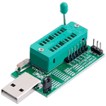
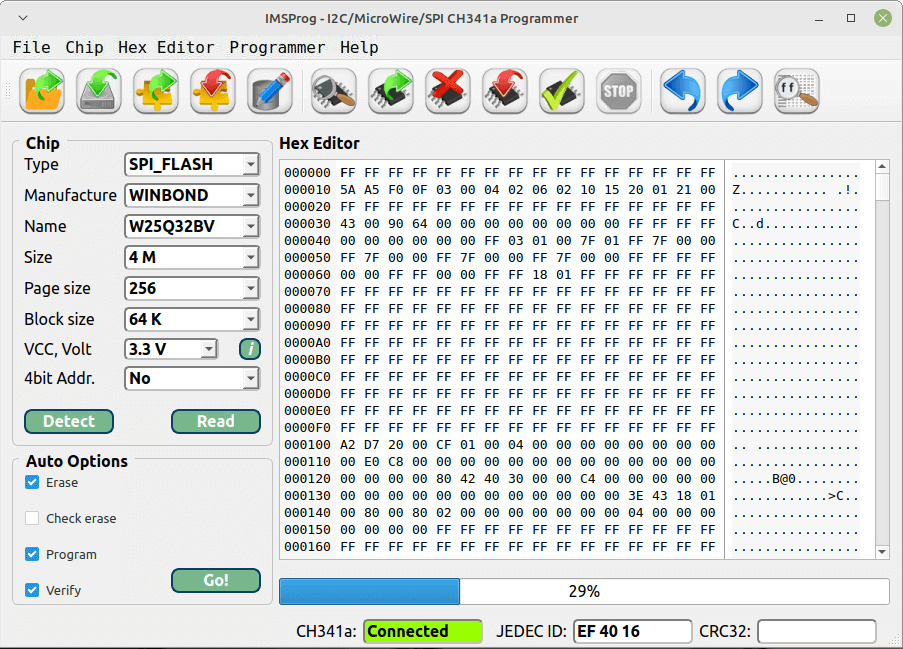
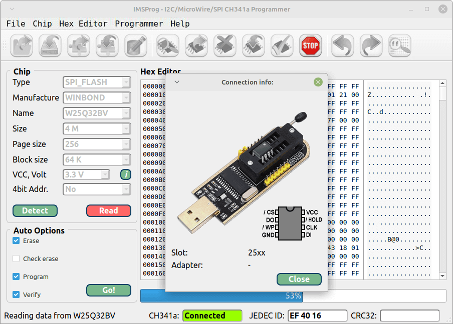
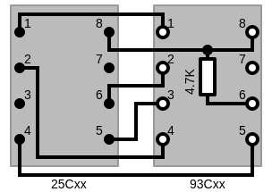
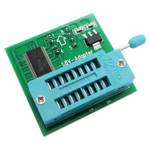
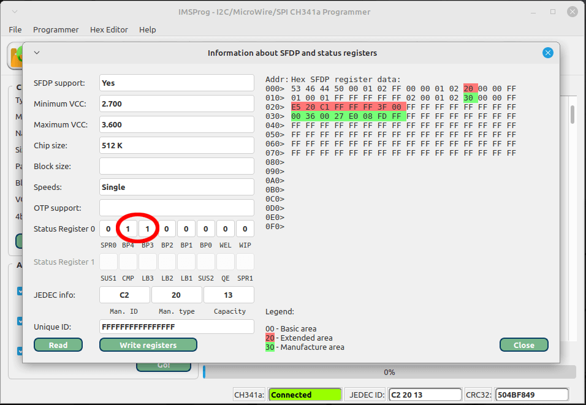
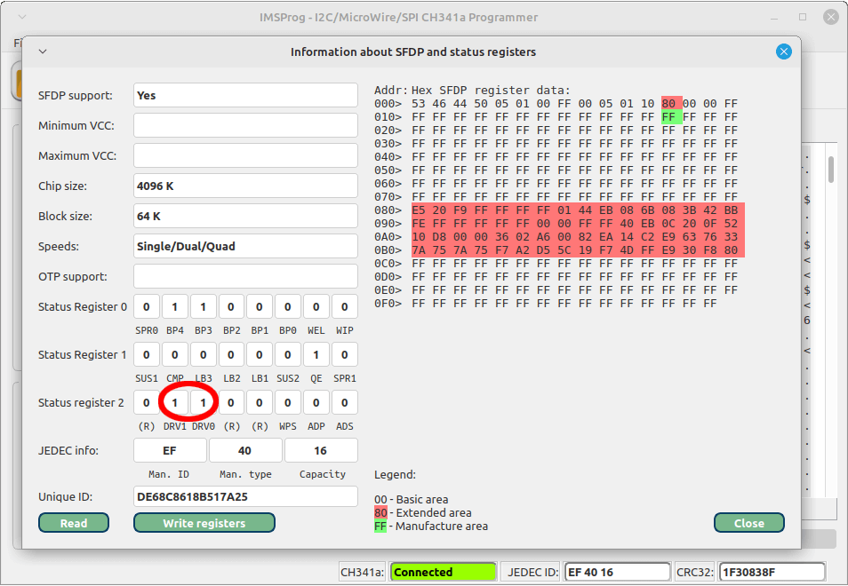
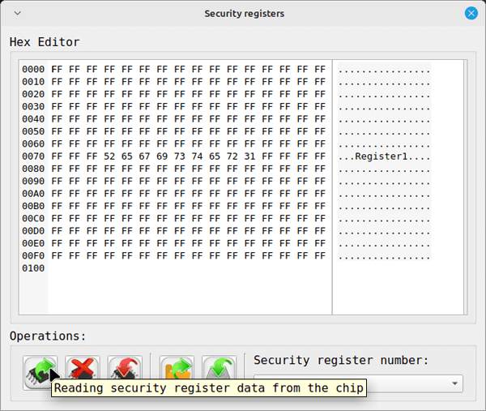
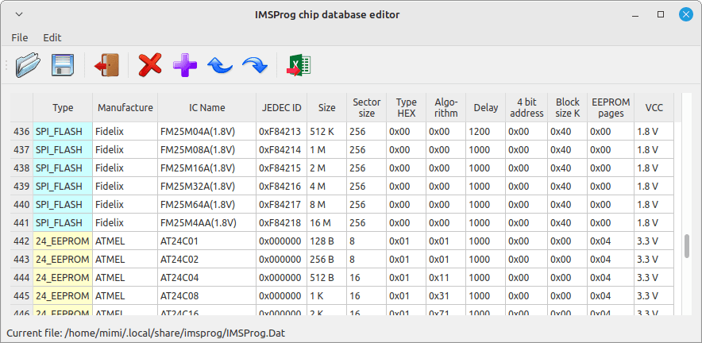

## IMSProg


* [System software requirements](#system-software-requirements)
* [How to use](#how-to-use)
* [List of supported chips](#list-of-supported-chips)
* [Packages](#packages)
* [Changelog](ChangeLog)
* [Project structure](#project-structure)
* [Chip database format](#chip-database-format)
* [Licensing](#Licensing)
* [Translations](#Translations)


**IMSProg** - **I**2C, **M**icroWire and **S**PI EEPROM/Flash chip 
**Prog**rammer - is a program to read, write EEPROM chips use the 
`CH341A programmer` device.

   

The IMSProg makes respect to [QHexEdit2](https://github.com/Simsys/qhexedit2) 
hex editor and [SNANDer programmer](https://github.com/McMCCRU/SNANDer). The 
format of the chip database is based on the format used in EZP2019, EZP2020, 
EZP2023, Minpro I, XP866+ programmers. Warning, format is not the same!

IMSProg is a collection of tools:

1. IMSProg - the chip programmer (it's the main part).

2. IMSProg_editor - chip database editor.

3. IMSProg_database_update - script to update chip database using external 
web-server.



 

## Compiling programmer
```
git clone https://github.com/bigbigmdm/IMSProg.git && cd IMSProg
cd IMSProg_programmer
mkdir build
cd build
cmake ..
make -j`nproc`
sudo make install
```
## Compiling editor
```
cd IMSProg_editor
mkdir build
cd build
cmake ..
make -j`nproc`
sudo make install
```
These commands are included in the `build_all.sh` file.

## System software requirements

### Linux

For build are needed:
- g++ or clang
- CMake
- libusb 1.0
- Qt5
- Qt5 Qt5LinguistTools
- pkgconf or pkg-config
- udev

On Debian and derivatives:

`sudo apt-get install cmake g++ libusb-1.0-0-dev qtbase5-dev qttools5-dev pkgconf`

On Debian >=13 and Ubuntu >=23.10:

`sudo apt-get install systemd-dev`

On older:

`sudo apt-get install udev`

Optionally if you want to use IMSProg_database_update script:
- zenity
- wget

`sudo apt-get install zenity wget`

:information_source: Debian < 11 and Ubuntu < 20.04 are not supported, you may 
unable to have it working on them.

### macOS
if using Homebrew then Xcode Command Line Tools will install by default, if not then install manually from terminal:   

```
xcode-select --install
```

install the required packages  

using brew:  

```
brew install qt@5 libusb cmake pkgconf
```

if not using the [build_all.sh](build_all.sh) script then make sure `libusb` is in your `C_INCLUDE_PATH`

```
export C_INCLUDE_PATH=/usr/local/opt/libusb/include
```
Optionally if you want to use IMSProg_database_update script:
```
brew install wget zenity
```


## How to use:

Note: for macOS use CMD `⌘` instead of CTRL for keyboard shortcuts.

## Chip programmer

### Launching
Can be launched from Terminal by running the command 
```
$ IMSProg
```

### Connecting
- Insert the chip into the appropriate slot of the CH341A programmer. The 
`24xxx` and `25xxx` series chips must be inserted directly, according to the 
markings on the PCB of the CH341A programmer. The `93xxx` series chips must be 
inserted into the `93xxx adapter` and the adapter into the marking `25xxx` 
programmer slot. The DataFlash `AT45DBxxx` series chips must be mounted in a 
`SOP-8 DIP-8` and this adapter shall be inserted into the `45xxx` adapter. 
The `45xxx` adapter must be installed in the programmer slot marked `25xxx`.


 
- If the chip supply voltage is 1.8 volt he must be inserted in 
`1.8 volt adapter` and the adapter into needed programmer slot.



- Plug the CH341A programmer into the USB socket of your computer and running 
the `IMSProg`.
- You can plug and unplug the programmer device (CH341A) to the USB port at 
any time when basic operations (reading, checking, and programming) are not in 
progress.
- Read more about adapters 
[here](https://github.com/bigbigmdm/Tools_for_CH341A_programmer?tab=readme-ov-file#Homemade-Chip-adapters).


### Chip type selecting
Select the type of chip used from the `Type` pop-up menu: `SPI FLASH` when 
using SPI NOR FLASH chips of the `25xxx` series, `24_EEPROM` when using I2C 
EEPROM of the `24xxx` series, `93_EEPROM` when using MicroWire EEPROM of the 
`93xxx` series, `45_EEPROM` when using DataFlash chips `AT45DBxxx` series.
When using `25xxx` series SPI NOR FLASH chips (Menu item `type` -> `SPI_FLASH`), 
or `AT45DBxx` series  SPI FLASH (Menu item `type` -> `45_EEPROM`) the `Detect` 
button will be available. When the `Detect` button or  
or `<Ctrl+D>` is pressed, the JEDEC information is read from the chip and all 
parameters of that chip are loaded from the chip database. Any parameter 
(`size`, `page size`, `block size`, `VCC voltage`, `and 4-bit address length`) 
can be changed manually. You can manually enter the `Manufacture` and `Name` 
pop-up menu data - all other parameters will be automatically loaded from the 
chip database. 
When using `24xxx` or `93xxx` or `95xxx` or `25xxx` SPI EEPROM (non NOR FLASH) 
series chips, it is necessary to manually enter the `Manufacture` and `Name` 
pop-up menu data - all other parameters will be automatically loaded from the 
chip database. 

### File operations
- The  or `<Ctrl+S>` button is used to save the 
computer buffer to a file.

- The  or `<Ctrl+O>` button is used to save the file in 
the computer buffer.

- The  or `<Ctrl+Shift-S>` button is used to 
save a part of the computer buffer to a file (the start address and length of 
the part must be entered). This operation can be used when splitting a binary 
data image into parts.

- The  or `<Ctrl+Shift-S>` button is used to 
load a small file to a certain address in the buffer. The data fragment in the 
buffer will be replaced with new data from the file.

- The  or `<Ctrl+Q>` button is used to invoke the 
chip database editor.

- The menu item `File / Import from Intel HEX` is used to save the Intel HEX 
file in the computer buffer.

- The menu item `File / Export to Intel HEX` is used to save the computer buffer 
to a file in Intel HEX format.

### Basic programmer operations
- Pressing `Read` or  or `<Ctrl+R>` to read data from 
the chip into the computer buffer.

- Pressing  or `<Ctrl+W>` to write data from the 
computer buffer into the chip.

- Pressing  or `<Ctrl+E>` will erase all data in the 
chip.

- Pressing the  or `<Ctrl+T>` button causes the 
data in the chip and in the computer buffer to be compared.

The progress bar shows the progress of the read, erase, and verify operations.

- The `Auto` button is used to perform erase, write and verify operations in 
sequence. If one of these operations is not needed, you can uncheck the 
checkbox for that operation.

- The  or `<Ctrl+I>` key is used to force interruption 
of chip read/write/erase/verify operations.

- The `i` key show the connection chip to CH341A device image form.
- The `Main menu -> Programmer -> Chip info` or `<Ctrl+P>` item shows the 
Serial Flash Discoverable Parameter (SFDP) register and the status registers 
of the SPI NOR flash memory chips.



If the SPI NOR FLASH chip is detected normally, but is not read (gives the 
message `Error reading sector 0`), then in the `Chip info` window you can 
change bits `BP4` and `BP3` to zero and press the `Write registers` button. 
Then repeat the chip reading operation.



If the SPI NOR FLASH chip is read unreliably (with a different checksum each 
time) and `Status Register 2` is available in the chip, you can change bits 
`DRV0` and `DRV1` to zero and press the Write Registers button. This will 
increase the power of the output stage of the `DO` pin of the chip. Then 
repeat the chip read operation.

For `25xxx`, `95xxx` and `45xxx` series chips that have only one status 
register, the `Chip info` form is as follows:


- The `Main menu -> Programmer -> Security Registers` or `<Ctrl+U>` item is used 
to work with SPI NOR Flash security registers data. This form allows reading, 
write, erase, save and load security register data from the computer.



The buttons at the bottom of the form (,
, , ,
) perform a similar function to the top buttons on the 
main form. The `Security register number:` drop-down menu allows you to select 
one of the valid registers for the current chip for operation. The security 
registers can be locked for writing forever. If you want to know about this, 
please see `Main Menu -> Programmer -> Chip Information` item or <Ctrl+P>, data 
fields in `LB3`, `LB2` and `LB1` in `Status register 1`. 
Please refer to the datasheet of your chip for detailed information.

### Buffer (Hex editor) operations
The hexadecimal chip editor (right side of the screen) is used to display and 
modify buffer data.

It contains the following controls:  undo, 
 redo, and the  
search/replace. The `[Ctrl+A]` key used to update the CRC24 checksum. The 
`[Ctrl+G]` key used to to move the cursor to the entered address.

## Chip database editor



Chip base editor - IMSProg_editor is a stand-alone program that can be launched 
from the `Development` menu or from the IMSProg program by clicking on 
.

All operations in the editor become available only after loading a chip base 
file with .Dat extension.

Menu `File`.

- `Open` or `[Ctrl+O]` or  allows you to 
load the data file.
- `Save` or `[Ctrl+S]` or  saves the chip 
parameter table to a database file.
- `Exit` or `[Ctrl+X]` or  - exits the 
editor.
- `Export to CSV format` or `[Ctrl+X]` or  
allows to unload data about chips in CSV format for further processing by 
spreadsheet software - LibreOffice Calc, OpenOffice Calc, Google Tables, etc.
- `Import from CSV file` or `[Ctrl+Shift+X]` or 
 - loads a table in CSV format and adds 
data from it to the existing data in the table.

Menu `Edit`.

- `Delete Rows` or `Del` or  - deletes one 
or more rows.
- `Add Row` or `Ins` or  - adds a row below 
the selected row and copies all data from the selected row to the new row.
- `Move Up` or '[Ctrl+Up]` or  - moves the 
selected line up.
- `Move Down' or `[Ctrl+Down]` or  - moves 
the selected row down.
- `Import selected rows to CSV format` or  
- saves selected rows to CSV file.

The most recent version of the chip database file can be downloaded from this 
page in both .Dat and .csv formats.

## Chip updater

 IMSProg_database_update uses the zenity graphical Gnome utility.  Once started, 
 it copies the downloaded database to the ~/.local/imsprog folder. The script 
 then displays the number of of chips in the database before and after the 
 upgrade.

## List of supported chips

### I2C EEPROM
24C01, 24C02, 24C04, 24C08, 24C16, 24C32, 24C64, 24C128, 24C256, 24C512, 
24C1024

### MicroWire EEPROM
93C46, 93C56, 93C66, 93C76, 93C86

### Serial SPI Bus EEPROM
- ST
  
M95010, M95020, M95040, M95080, M95160, M95320, M95640, M95128, M95256, M95512, 
M95M01, M95M02

- ATMEL

AT25010, AT25020, AT25040, AT25080, AT25160, AT25320, AT25640, AT25128, AT25256, 
AT25F512, AT25F1024, AT25F2048, AT25F4096

- MICROCHIP 

25AA010, 25AA020, 25AA040, 25AA080, 25AA160, 25AA320, 25AA640, 25AA128, 25AA256, 
25AAF512, 25AAF1024, 25LC010, 25LC020, 25LC040, 25LC080, 25LC160, 25LC320, 
25LC640, 25LC128, 25LC256, 25LC512, 25LC1024

- ONSEMI

CAT25C01, CAT25C02, CAT25C04, CAT25C08, CAT25C16, CAT25C32, CAT25C64, CAT25C128, 
CAT25C256, CAT25C512

### DataFlash 45xx
- ATMEL

AT45DB011, AT45DB021, AT45DB041, AT45DB081, AT45DB161, AT45DB321

- ADESTO

AT45DB011, AT45DB021, AT45DB041, AT45DB081, AT45DB161, AT45DB321, AT45DB641

### SPI NOR Flash
- SPANSION

FL016AIF, S25FL016P, S25FL032P, FL064AIF, S25FL064P, S25FL256S, S25FL128P, 
S25FL129P, S25FL204K, S25FL208K, S25FL116K, S25FL132K, S25FL164K

- XTX
  
XT25F02E, XT25F04D, XT25F08B, XT25F16B, XT25F32F, XT25F64F, XT25F128F, 
XT25F256B, XT25W02E, XT25W04D, XT25Q08D(1.8V), XT25Q16D(1.8V), XT25Q64D(1.8V), 
XT25F128D(1.8V)

- ACE

ACE25AC512G, ACE25AC100G, ACE25AC200G, ACE25AC400G

- EON
  
EN25B10T, EN25B20T, EN25B40T, EN25B80T, EN25B16T, EN25B32T, EN25B64T, EN25P64, 
EN25Q40A, EN25Q80B, EN25Q16, EN25Q32C, EN25Q64, EN25Q128, EN25F10A, EN25F20A, 
EN25F40, EN25F80, EN25F16, EN25F32, EN25S10A(1.8V), EN25S20A(1.8V), 
EN25S40A(1.8V), EN25S80B(1.8V), EN25S16B(1.8V), EN25S64A(1.8V), EN25QE16A, 
EN25QE32A, EN25E10A, EN25E40A, EN25SE16A(1.8V), EN25SE32A(1.8V), EN25T80, 
EN25T16, EN25QA32B, EN25QA64A, EN25QA128A, EN25QW16A, EN25QW32A, EN25QH16, 
EN25QH32B, EN25QH64A, EN25QH128A, EN25Q256, EN25QX64A, EN25QX128A, EN25QX256A, 
EN25QY256A, EN25SX64A(1.8V), EN25SX128A(1.8V)

- ATMEL

AT25LS321(1.8V), AT25LS128A(1.8V), AT25LS641(1.8V), AT26DF161, AT25DF321, 
AT25DF641

- MICRON

M25P10, M25P20, M25P40, M25P80, M25P016, M25P32, M25P64, M25P128, N25Q032A, 
N25Q064A, MT25QL64AB, N25Q128A, MT25QL128AB, N25Q256A, MT25QL256AB, MT25QL512AB, 
N25Q032A(1.8V), N25Q064A(1.8V), MT25QU64AB(1.8V), N25Q128A(1.8V), 
MT25QU128AB(1.8V), MT25QU256AB(1.8V), MT25QU512AB(1.8V)

- XMC
  
XM25QH10B, XM25QH20B, XM25QH40B, XM25QH80B, XM25QH16C, XM25QH32B, XM25QH64C, 
XM25QH128C, XM25QH256C, XM25QH512C, XM25LU64C(1.8V), XM25LU128C(1.8V), 
XM25QU256C(1.8V), XM25QU512C(1.8V), XM25QW16C, XM25QW32C, XM25QW64C, XM25QW128C, 
XM25QW256C, XM25QW512C, XM25QU41B(1.8V), XM25QU80B(1.8V), XM25QU16C(1.8V), 
XM25LU32C(1.8V), XM25QH32A, XM25QH64A, XM25QH128A

- AMIC
  
AT25L05P, A25L10PU, A25L20PU, A25L40PU, A25L80PU, A25L16PU, A25L10PT, A25L20PT, 
A25L40PT, A25L80PT, A25L16PT, A25L010, A25L020, A25L040, A25L040, A25L080, 
A25L016, A25L032, A25LQ080, A25LQ16, A25LQ32, A25LQ64

- EXCELSEMI
  
ES25P10, ES25P20, ES25P40, ES25P80, ES25P16, ES25P32, ES25M40A, ES25M80A, 
ES25M16A

- DOUQI
  
DQ25Q64AS

- Zbit
  
ZB25LD10A(1.8V), ZB25LD20A(1.8V), ZB25LD40B(1.8V), ZB25LD80(1.8V), ZB25D10A, 
ZB25D20A, ZB25D40B, ZB25D80B, ZB25VQ16, ZB25VQ32, ZB25VQ64, ZB25VQ128, 
ZB25LQ16(1.8V), ZB25LQ32(1.8V), ZB25LQ64(1.8V), ZB25LQ128(1.8V), ZB25VQ20A, 
ZB25VQ40A, ZB25VQ80A, ZB25VQ16A, ZD25D20, ZD25D40, ZD25D80

- ONSemi

LE25U20AMB, LE25U40CMC

- Boya
  
BY25Q05AW, BY25Q10AW, BY25Q20BL(1.8V), BY25Q40BL, BY25Q80AW(1.8V), 
BY25Q16BL(1.8V), BY25D05AS, BY25D10AS, BY25D20AS, BY25D40AS, BY25Q80BS, 
BY25Q16BS, BY25Q32BS, BY25Q64AS, BY25Q128AS, BY25Q256ES, BY25Q10AL(1.8V), 
BY25Q20AL(1.8V), BY25Q40AL(1.8V), BY25Q32AL(1.8V), BY25Q64AL(1.8V), 
BY25Q128EL(1.8V)

- PFLASH

Pm25LQ512B, Pm25LQ010B, Pm25LD020, Pm25LQ020B, PM25LQ016, PM25LQ032, PM25LQ064, 
PM25LQ128, Pm25LV010, Pm25LV020, Pm25LQ040B, Pm25LV040

- Puya

P25Q06H, P25Q40H, PY25Q128HA, PY25Q256HB, PY25Q512HB, P25Q11H, P25Q21H, P25Q10H, 
P25Q20H, P25Q80H, P25Q16H, P25Q32H, P25Q64H, P25Q128H

- ESMT

F25L004A, F25L008A, F25L016, F25L032, F25L064, F25L16QA, F25L32QA, F25L64QA

- ISSI
  
IS25WQ020(1.8V), IS25WQ040(1.8V), IS25WQ080(1.8V), IS25LQ010, IS25LQ020, 
IS25LP040E, IS25LP080D, IS25LP016D, IS25LP032D, IS25LP064D, IS25LP128F, 
IS25LP256D, IS25LP512D, IS25WP512E(1.8V), IS25WP010E(1.8V), IS25WP020E(1.8V), 
IS25WP040D(1.8V), IS25WP080D(1.8V), IS25WP016D(1.8V), IS25WP032D(1.8V), 
IS25WP064D(1.8V), IS25WP128F(1.8V), IS25WP256D(1.8V), IS25WP512D(1.8V)

- Fudan
  
FM25W02, FM25W04, FM25W16, FM25W32, FM25W64, FM25W128, FM25F005, FM25F01B, 
FM25F02A, FM25F04A, FM25Q04, FM25Q08, FM25Q16, FS25Q32, FS25Q64, FS25Q128

- Zetta
  
ZD25Q64B, ZD25LQ128(1.8V), ZD25LQ64(1.8V), ZD25WD20B, ZD25WD40B, ZD25Q80C, 
ZD25Q16B, ZD25Q32C

- PCT

PCT25VF016B, PCT25VF032B, PCT25VF064C, PCT25VF020B, PCT25VF040B, PCT25VF080B, 
PCT26VF016, PCT26VF032, PCT25VF010A

- MXIC

MX25L512E, MX25L1006E, MX25L2005, MX25L4005A, MX25L8005M, MX25L1605D, 
MX25L3205D, MX25L6405D, MX25L12805D, MX25L25635E, MX25L51245G, MX25L5121E, 
MX25L1021E, MX25L1633E, MX25L1635E, MX25U5121E(1.8V), MX25U1001E(1.8V), 
MX25U2035F(1.8V), MX25U4035F(1.8V), MX25U80356(1.8V), MX25U1632F(1.8V), 
MX25U3232F(1.8V), MX25U6432F(1.8V), MX25U12832F(1.8V), MX25U25643G(1.8V), 
MX25U51245G(1.8V), MX25L1655D, MX25L6455E, MX25L12855E, MX25L25655E, MX25R1035F, 
MX25R2035F, MX25R4035F, MX25R8035F, MX25R1635F, MX25R3235F, MX25R6435F, 
MX25L3225D, MX25L3255D

- GigaDevice

GD25F40, GD25F80, GD25D40, GD25D80, GD25D05C, GD25D10C, GD25Q20C, GD25Q40C, 
GD25Q80C, GD25Q16C, GD25Q32, GD25Q64CSIG, GD25Q128CSIG, GD25Q256CSIG, GD25VQ21B, 
GD25VQ40C, GD25VQ80C, GD25VQ16C, GD25LD05C(1.8V), GD25LD10C(1.8V), 
GD25LD20C(1.8V), GD25LD40C(1.8V), GD25LQ80C, GD25LQ16C, GD25LQ32E, 
GD25LQ64E(1.8V), GD25LQ128(1.8V), GD25LQ256D(1.8V), GD25WD05C, GD25WD10C, 
GD25WD20E, GD25WD40E, GD25WD80C, GD25WQ20E, GD25WQ40E, GD25WQ80E, GD25WQ16E, 
GD25WQ32E, GD25WQ64E, GD25WQ128E, GD25WB256E, GD25LB512ME(1.8V), YC25Q128

- Nantronix

N25S80, N25S32

- PARAGON

PN25F08, PN25F16, PN25F32, PN25F64, PN25F128

- WINBOND

W25P80, W25P16, W25P32, W25P64, W25X05, W25X10, W25X20, W25X40, W25X80, W25X16, 
W25X32VS, W25X64, W25Q05CL, W25Q10Cl, W25Q20CL, W25Q40BV, W25Q80BL, W25Q16DV, 
W25Q32BV, W25Q64BV, W25Q128BV, W25Q256FV, W25Q20BW(1.8V), W25Q80, 
W25Q10EW(1.8V), W25Q20EW(1.8V), W25Q40EW(1.8V), W25Q80EW(1.8V), W25Q16JW(1.8V), 
W25Q32FW(1.8V), W25Q64DW(1.8V), W25Q128FW(1.8V), W25Q256JW(1.8V), 
W25M512JW(1.8V), W25Q512JV, W25M512JV, W25Q32JW(1.8V)

- Fidelix

FM25Q04A, FM25Q08A, FM25Q16A, FM25Q32A, FM25Q64A, FM25Q128A, FM25M04A(1.8V), 
FM25M08A(1.8V), FM25M16A(1.8V), FM25M32A(1.8V), FM25M64A(1.8V), FM25M4AA(1.8V)

- UCUNDATA (UCUN Technology)

UC25HQ05, UC25HQ10, UC25HQ20, UC25HQ40, UC25HQ80, UC25HQ16, UC25HQ32, UC25HQ64,
UC25IQ128

The latest version of the chip database can be found 
[here](https://antenna-dvb-t2.ru/dl_all/IMSProg.Dat).
You can download it and copy it to the ~/.local/imsprog folder:

`cp IMSProg.Dat ~/.local/imsprog`

[](img/IMSProg_1_0_24.mp4)

## Packages
- There is a work in progress for add IMSProg to official `Debian` (and 
derivatives repositories)

  For some Ubuntu versions you can use this PPA by adding `ppa:bigmdm/imsprog` 
  to your system's Software Sources.
```
sudo add-apt-repository ppa:bigmdm/imsprog
sudo apt update
sudo apt install imsprog
``` 
  Is also possible manually build deb package using `debian/latest` branch.

- For some versions of Fedora, you can use the official repositories.
```
sudo dnf install imsprog
```

<a href="https://repology.org/project/imsprog/versions">
    
</a>

- The `RPM package` by [Red Soft](https://redos.red-soft.ru/) can be downloaded  
[here](http://repo.red-soft.ru/redos/7.3/x86_64/updates/)
- The `RPM package` by [ALT Linux](https://packages.altlinux.org/en/sisyphus/srpms/IMSProg/)
- The `RPM package` by [ROSA Linux](https://mirror.rosalinux.ru/rosa/rosa2021.1/repository/x86_64/contrib/release/)
- The `ARCH AUR repository` by [kjkent](https://github.com/kjkent) is [here](https://aur.archlinux.org/packages/imsprog)
- The `openSUSE` package is [here](https://software.opensuse.org/package/IMSProg?search_term=imsprog)
- The `Debian` package is [here](https://tracker.debian.org/pkg/imsprog)
- The Windows release by [Anime4000](https://github.com/Anime4000) is [here](https://github.com/Anime4000/IMSProg/releases/tag/v1.5.2-win64)


## Project structure

```
IMSProg _files_							          _folder_
================================================================================
IMSProg                                                  /usr/bin
IMSProg_editor                                           /usr/bin
IMSProg_programmer/other/IMSProg_database_update         /usr/bin

IMSProg_programmer/database/IMSProg.Dat                  /usr/share/imsprog
                                                         ~/.local/share/imsprog

IMSProg_programmer/other/71-CH341.rules                  /lib/udev/rules.d

IMSProg_programmer/other/index.html                      /usr/share//doc/imsprog/html

IMSProg_programmer/language/chipProgrammer_ru_RU.qm      /usr/share/imsprog
IMSProg_programmer/language/chipProgrammer_es_ES.qm      /usr/share/imsprog
IMSProg_programmer/language/chipProgrammer_de_DE.qm      /usr/share/imsprog
IMSProg_programmer/language/chipProgrammer_zH_CN.qm      /usr/share/imsprog
IMSProg_programmer/language/chipProgrammer_uk_UA.qm      /usr/share/imsprog
IMSProg_programmer/language/chipProgrammer_hu_HU.qm      /usr/share/imsprog
IMSProg_programmer/language/chipProgrammer_pt_BR.qm      /usr/share/imsprog

IMSProg_editor/language/chipEditor_ru_RU.qm              /usr/share/imsprog
IMSProg_editor/language/chipEditor_de_DE.qm              /usr/share/imsprog
IMSProg_editor/language/chipEditor_es_ES.qm              /usr/share/imsprog
IMSProg_editor/language/chipEditor_zh_CN.qm              /usr/share/imsprog
IMSProg_editor/language/chipEditor_uk_UA.qm              /usr/share/imsprog
IMSProg_editor/language/chipEditor_hu_HU.qm              /usr/share/imsprog
IMSProg_editor/language/chipEditor_pt_BR.qm              /usr/share/imsprog

IMSProg_programmer/other/IMSProg.desktop                 /usr/share/applications
IMSProg_programmer/other/IMSProg_editor.desktop          /usr/share/applications
IMSProg_programmer/other/IMSProg_database_update.desktop /usr/share/applications

IMSProg_editor/other/IMSProg_editor.1.gz                 /usr/share/man/man1
IMSProg_programmer/other/IMSProg.1.gz                    /usr/share/man/man1
IMSProg_programmer/other/IMSProg_database_update.1.gz    /usr/share/man/man1

IMSProg_programmer/img/IMSProg64.png                     /usr/share/pixmaps
IMSProg_programmer/img/IMSProg_database_update.png       /usr/share/pixmaps
IMSProg_editor/img/chipEdit64.png                        /usr/share/pixmaps

IMSProg_programmer/other/other/io.github.bigbigmdm.imsprog.metainfo.xml /usr/share/metainfo
IMSProg_editor/other/other/io.github.bigbigmdm.imsprog_editor.metainfo.xml /usr/share/metainfo
IMSProg_programmer/other/other/io.github.bigbigmdm.imsprog_database_update.metainfo.xml /usr/share/metainfo

```
## Chip database format

IMSProg.Dat file structure:

Chip string lenght: 0x44 (68) bytes;

```
offset	 Size   Value
00 -     2F     ASCII Chip type, Name and Manufacture, 0x00 filling
30        1     NOR FLASH Chip Size code   / 0x00 - other chips
31        1     NOR FLASH Chip ID Code     / 0x00 - other chips
32        1     NOR FLASH Manufacture code / 0x00 - other chips
33              0x00
34        4     Chip Size
35 	
36 	  
37 
38        2     Sector size
39 
3A        1     Binary chip type:
                - 0x00 - SPI NOR FLASH 
                - 0x01 - 24xxx I2C
                - 0x02 - 93xxx MicroWire
                - 0x03 - 25xxx SPI EEPROM
                - 0x04 - 95xxx ST SPI EEPROM
                - 0x05 - AT45DBxxx SPI EEPROM
3B        1     Algoritm code number:
                - SPI NOR Flash always 0x00
                - I2C (24xxx) 0x?1 - address size 1 byte 
                - I2C (24xxx) 0x?2 - address size 2 bytes 
                - I2C (24xxx) 0x1? - address mask 1
                - I2C (24xxx) 0x3? - address mask 3
                - I2C (24xxx) 0x7? - address mask 7
                - MicroWire (93xxx) - 0x1? - organisation 16 bit
                - MicroWire (93xxx) - 0x0? - organisation 8 bit
                - MicroWire (93xxx) - 0x?7 -  7 bit address number
                - MicroWire (93xxx) - 0x?9 -  9 bit address number
                - MicroWire (93xxx) - 0x?A - 10 bit address number
                - MicroWire (93xxx) - 0x?B - 11 bit address number
                - 95xxx ST SPI EEPROM - 0x01 - 8 bit address
                - 95xxx ST SPI EEPROM - 0x02 - 16 bit address
                - 25xxx SPI EEPROM  - 0x?0 - 8 bit address
                - 25xxx SPI EEPROM  - 0x?1 - 16 bit address
                - 25xxx SPI EEPROM  - 0x?2 - 24 bit address
                - 25xxx SPI EEPROM  - 0x0? - fill erasing
                - 25xxx SPI EEPROM  - 0x1? - The third bit of the command is used for the high bit of the address
                - 25xxx SPI EEPROM  - 0x2? - erasing with use CHIP  FULL ERASE command
                - 45xxx SPI EEPROM  - 0x0? - ATMEL command pattern
                - 45xxx SPI EEPROM  - 0x1? - ADESTO commant pattern
                - 45xxx SPI EEPROM  - 0x?9 -  9 bit sector address number
                - 45xxx SPI EEPROM  - 0x?A - 10 bit sector address number
                - 45xxx SPI EEPROM  - 0x?B - 11 bit sector address number
                - 45xxx SPI EEPROM  - 0x?C - 12 bit sector address number
                - 45xxx SPI EEPROM  - 0x?D - 13 bit sector address number
                - 45xxx SPI EEPROM  - 0x?F - 15 bit sector address number
                - SPI NOR Flash - algorithm number for working with  security registers
3C        2     Timing parameter:
3D              3000/1000/500/300/200/100 - NOR FLASH, 4000/2000 - 24xxx, 100 - 93xxx
3E        2     SPI NOR Flash 4bit address type:
                - 0x?0 - Not used (3 bit address data)
                - 0x?1 - Used (4 bit address data)
                - 0x01 - Default 4 bit command using
                - 0x11 - Winbond algorithm
                - 0x21 - Spansion algorithm
3F        1     0x00
40        1     SPI NOR FLASH block size in KB (64K = 0x40)
41        1     0x00
42        1     EEPROM pages 0x01 - 0x04
43        1     VCC 00=>3.3V 01=>1.8V 02=>5.0V
The end record is 0x44 (68) zero bytes.
```
## Licensing

Copyright (C) 2023 - 2025 Mikhail Medvedev. 
This project use [GPL-3+ License](https://www.gnu.org/licenses/gpl-3.0.html), 
some parts taken from project [SNANDer](https://github.com/McMCCRU/SNANDer/commits?author=McMCCRU) 
are [GPL-2+](https://www.gnu.org/licenses/old-licenses/gpl-2.0.html) and from 
[QHexEdit2](https://github.com/Simsys/qhexedit2) is [LGPL-2.1](https://www.gnu.org/licenses/old-licenses/lgpl-2.1.html). 

## Translations

- Hungarian translation by [blackPantherOS](https://github.com/blackPantherOS)
- Italian translation by Marino Pasquale and [Giovanni Scafora](https://github.com/giovanni69)
- Brasil translation by [Alexandre C. Leite](https://github.com/alexandrecleite)
- Ukrainian translation by [Sergey Golovko](https://github.com/cappelikan)
- Chinese translation by [Tian-HP](https://github.com/Tian-HP)
- German translation by [wucke13](https://github.com/wucke13)

Anyone can add or improve a translation by making a pull request.
Translations files are located in: [IMSProg_programmer/language/](https://github.com/bigbigmdm/IMSProg/tree/main/IMSProg_programmer/language) and [IMSProg_editor/language/](https://github.com/bigbigmdm/IMSProg/tree/main/IMSProg_editor/language)

You can also add translation to the desktop files ([IMSProg.desktop](https://github.com/bigbigmdm/IMSProg/blob/main/IMSProg_programmer/other/IMSProg.desktop),
 [IMSProg_database_update.desktop](https://github.com/bigbigmdm/IMSProg/blob/main/IMSProg_programmer/other/IMSProg_database_update.desktop), 
  [IMSProg_editor.desktop](https://github.com/bigbigmdm/IMSProg/blob/main/IMSProg_editor/other/IMSProg_editor.desktop)),
 to the update script ([IMSProg_database_update](https://github.com/bigbigmdm/IMSProg/blob/main/IMSProg_programmer/other/IMSProg_database_update)) 
 and to the appstream metadata files ([io.github.bigbigmdm.imsprog_editor.metainfo.xml](https://github.com/bigbigmdm/IMSProg/blob/main/IMSProg_editor/other/io.github.bigbigmdm.imsprog_editor.metainfo.xml), 
[io.github.bigbigmdm.imsprog_database_update.metainfo.xml](https://github.com/bigbigmdm/IMSProg/blob/main/IMSProg_programmer/other/io.github.bigbigmdm.imsprog_database_update.metainfo.xml), 
[io.github.bigbigmdm.imsprog.metainfo.xml](https://github.com/bigbigmdm/IMSProg/blob/main/IMSProg_programmer/other/io.github.bigbigmdm.imsprog.metainfo.xml)).
